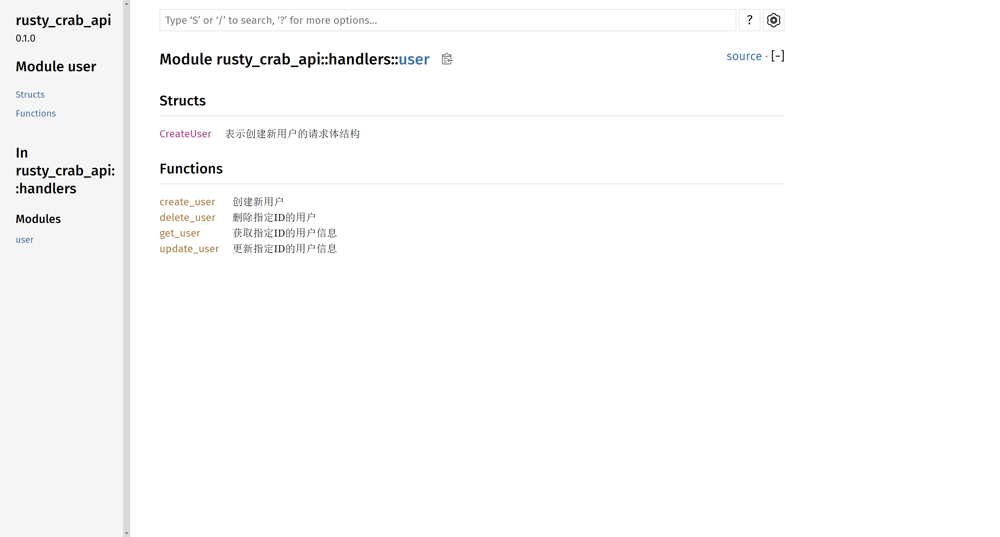
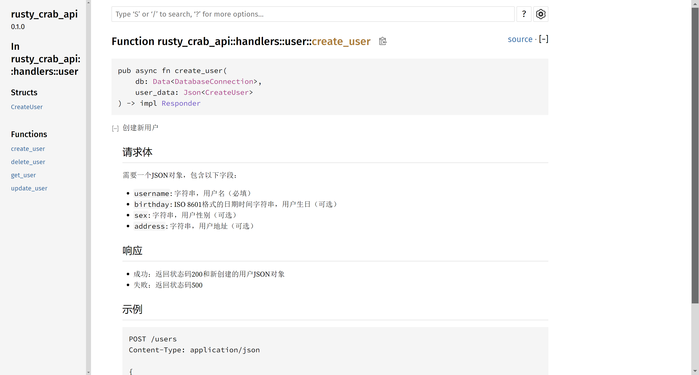
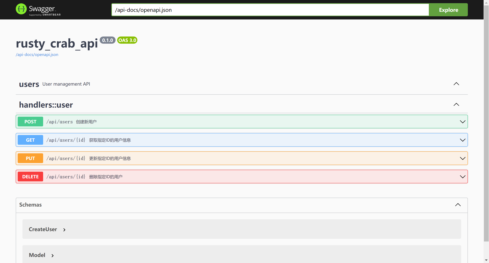
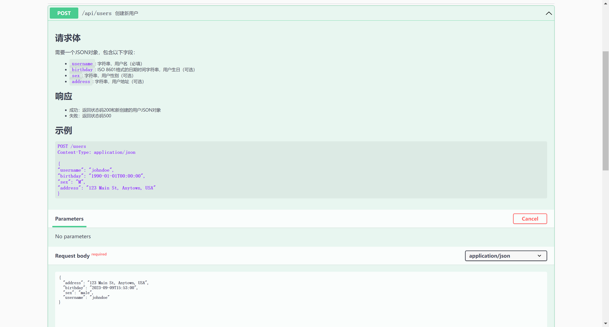

# rusty_crab_api

Rust语言使用Actix-web和SeaORM库，数据库使用PostgreSQL，开发增删改查项目，同时可以通过Swagger UI查看接口文档

## 开发

PostgreSQL创建数据库

```sql
CREATE TABLE "user" (
  id SERIAL PRIMARY KEY,
  username VARCHAR(32) NOT NULL,
  birthday TIMESTAMP,
  sex VARCHAR(10),
  address VARCHAR(256)
);

COMMENT ON COLUMN "user".username IS '用户名称';
COMMENT ON COLUMN "user".birthday IS '生日';
COMMENT ON COLUMN "user".sex IS '性别';
COMMENT ON COLUMN "user".address IS '地址';
```

安装sea-orm-cli

```
cargo install sea-orm-cli
```

生成entity

```
sea-orm-cli generate entity -u postgres://[用户名]:[密码]@[IP]:[PORT]/[数据库] -o src/entity
```

## 启动项目

```
cargo run
```

## 查看标准Rust文档

```
cargo doc --open
```





## 查看Swagger UI接口文档

```
http://localhost:8080/swagger-ui/
```




